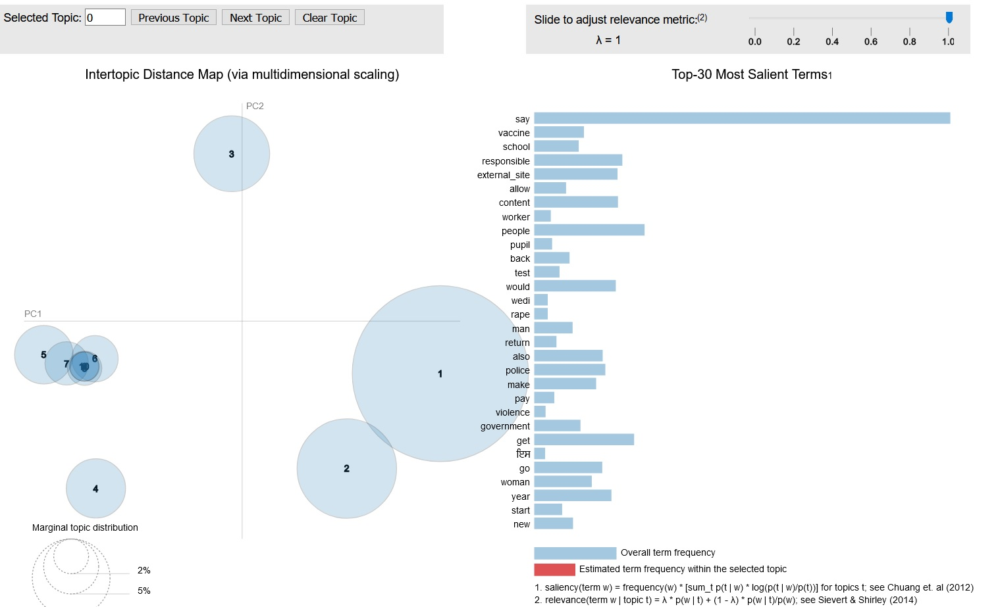
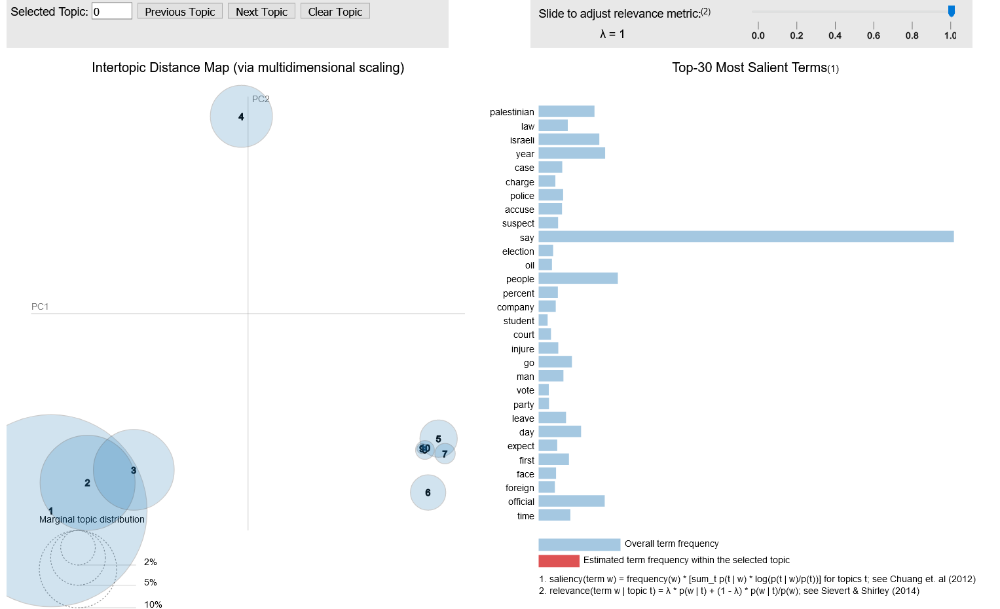

# Article App

Example Article app using django.
Scraped Articles from BBC and Aljazeera using a crawler with the help of the library scrapy.
Trained a LDA model on around 2000 articles for the  purpose of topic modelling using the gensim module.

## Latent Dirichlet Allocation (LDA)

In natural language processing, the latent Dirichlet allocation (LDA) is a generative statistical model that allows sets of observations to be explained by unobserved groups that explain why some parts of the data are similar. For example, if observations are words collected into documents, it posits that each document is a mixture of a small number of topics and that each word's presence is attributable to one of the document's topics. LDA is an example of a topic model and belongs to the machine learning toolbox and in wider sense to the artificial intelligence toolbox.[1]

Plainly explained LDA is an algorithm used for topic modelling that takes as input separate bodies of texts and than categorizes them in a given number of topics based on word appearances. The model creates a vector for each document that than can be used to find similar documents.

The Documents used to train the model are really important and should be close to the application domain in order for the model to have a meaningful result on unseen bodies of text.
### Training

The algorithm should be trained on text without special characters and commonly used words.The model has various parameters to experiment with, the most important one being the number of topics.

### Evaluation

LDA can't be evaluated like using common metrics like accuracy so we would have to test the model ourselves and also use some other metrics unique to the model itself.  Below we are going to be using perplexity and topic coherence to evaluate our models.
There is actually more than one topic coherence kind.
- U-mass
- C_v
- C_p
- C_uci
- C_umass
- C_npmi
- C_a
### Similarity

For Finding similar documents gensim has a similarity class that uses cosine similarity but we will have to see what kind of results it produces.Many people also recommend Jensen-Shannon distance metric.
Some of the possible  similarity metrics are
- Jensen-Shannon
- Hellinger distance
- Kullback–Leibler
- Jaccard

## Visualization

As mentioned above for the creation of the lda model I used the gensim library. For the visualization of the resulting model there is a great library called pyLDAvis.This tool creates an interactive html page with various important data about the model.

### Results

Initially I used 500 articles for my first model and as parameters I set it to num_topics=20, random_state=100,update_every=1, chunksize=100, passes=10, alpha='auto'

Download the html file [here]( https://github.com/fabianhoegger/Article_App/blob/main/main/properties/lda/lda10/ldavis10.html)

After removing some non english documents I retrained the model on about 350 documents with the same parameters.Here I selected one of the topics to show how the html file works

Download the html file [here]( https://github.com/fabianhoegger/Article_App/blob/main/main/properties/lda/lda10/lda10_cleaned/ldavis10clean.html)

Below is the result of the model with the same 500 articles but 20 topics

Download the html file [here](https://github.com/fabianhoegger/Article_App/blob/main/main/properties/lda/lda20/ldavis20.html)

Finally I tried training on all the english files I had Scraped
first dividing them in 10 topics and then 20.

Download the html file [here](hhttps://github.com/fabianhoegger/Article_App/blob/main/main/properties/lda/lda_1835/lda_10_1835/ldavisall.html)

Download the html file [here](https://github.com/fabianhoegger/Article_App/blob/main/main/properties/lda/lda_1835/lda_20_1835/ldavisall20.html)

### Results
>On the first table there are various models with different number of articles and their corresponding perplexity, U-mass coherence and number of topics.

|Model | Perplexity |  U-mass Coherence| Articles |Topics
| -----| ----------  | ----------------|----------|------|
| LDA10 | -8.270   | -9.366|         500|10|
| LDA20 | -13.652  |  -8.049|      500|20|
|lda_10_1835|-8.488| -5.999|      1835|10|
|lda_20_1835 | -12.778| -8.678|   1835|20|
|lda_5_2000|-8.133    | -20.233|   2000|5|

> Because  using U-mass coherence didn't help to distinguish the perfomance of the models for 2450 articles I started using  C-V coherence which immediately made things clearer.

|Model | Perplexity |  U-mass Coherence| C-V Coherence|Topics
| -----| ----------  | ----------------|----------|----|
|lda_2450|-8.128     | -19.412|0.694| 5|
|lda10_2450|-8.785   |-19.537|0.672|10|
|lda15_2450|-15.156 |-18|0.555|15|
|lda_20_2450|-24.223 |-17.727| 0.556|20|
|lda30_2450|-33.610| -18.760| 0.639 |30|

## Scraping

To scrap bbc and aljazeera I used scrapy's SitemapSpider class that automatically crawls a websites sitemap which is really usefull.
Currently For each article the scraper downloads the page url,title and text body.
[Click here to view the scripts](https://github.com/fabianhoegger/Article_App/tree/main/main/scraper/scraper/spiders).
The scrapy project is connected to my django app and the
Data is stored to a Django postgresql database.
## Website

After gathering the articles I created a small website where you can view some article titles and click a button that starts training an lda model.

## Links

https://www.analyticsvidhya.com/blog/2016/08/beginners-guide-to-topic-modeling-in-python/
https://datascience.aero/topic-modelling/
http://qpleple.com/perplexity-to-evaluate-topic-models/

https://www.machinelearningplus.com/nlp/topic-modeling-gensim-python/#17howtofindtheoptimalnumberoftopicsforlda

https://www.machinelearningplus.com/nlp/topic-modeling-gensim-python/
https://towardsdatascience.com/lets-build-an-article-recommender-using-lda-f22d71b7143e
https://radimrehurek.com/gensim/similarities/docsim.html
https://radimrehurek.com/gensim/auto_examples/core/run_similarity_queries.html

https://radimrehurek.com/gensim/auto_examples/core/run_corpora_and_vector_spaces.html#sphx-glr-auto-examples-core-run-corpora-and-vector-spaces-py

https://towardsdatascience.com/topic-modelling-in-python-with-nltk-and-gensim-4ef03213cd21

https://medium.com/analytics-vidhya/gensim-lda-topic-modeling-for-article-discovery-9707237e4f0d

https://medium.com/analytics-vidhya/web-scraping-with-scrapy-and-django-94a77386ac1b

https://www.machinelearningplus.com/nlp/topic-modeling-visualization-how-to-present-results-lda-models/

https://miningthedetails.com/blog/python/lda/GensimLDA/
https://groups.google.com/g/gensim
https://rare-technologies.com/what-is-topic-coherence/
